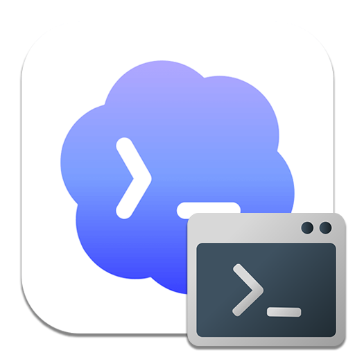
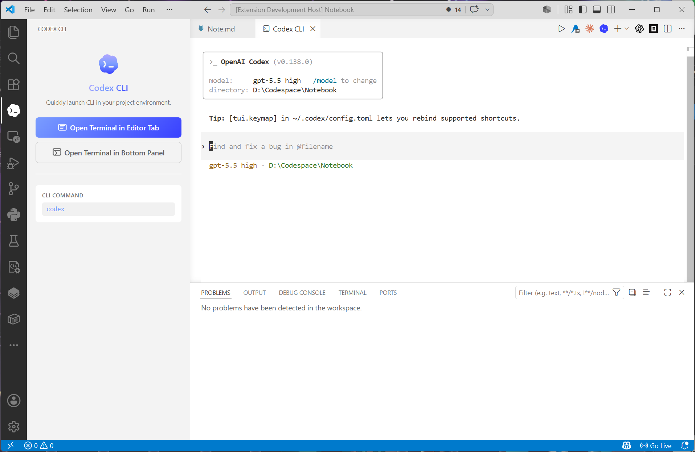

  

<h1 align="center">Codex CLI Live</h1>

  
  
  

  <strong>Fast launch Codex CLI directly from within VS Code.</strong> 
  A lightweight, flat-design sidebar extension that puts Codex one click away — in the editor tab, bottom panel, or right from the activity bar.

---

## ✨ Features

- **One-click Launch** — Start Codex CLI from the sidebar, editor toolbar, or command palette.
- **Editor Toolbar Button** — A theme-adaptive toolbar button sits in every editor tab's title bar.
- **Editor Tab & Bottom Panel** — Choose where Codex opens: as a full editor tab or in the bottom panel.
- **Configurable Command** — Customize the CLI command to match your setup (default: `codex`).
- **Clean, Native UI** — Sidebar uses VS Code's CSS custom properties so it blends with your theme.

---

## 📸 Preview

  

---

## 🚀 Usage

### Launch Codex CLI

There are three ways to start Codex:

| Method | How |
|--------|-----|
| **Editor Toolbar** | Click the Codex icon in any editor tab's title bar |
| **Activity Bar** | Click the Codex icon in the activity bar, then click a launch button |
| **Command Palette** | `Ctrl+Shift+P` → *"Codex CLI: Open Terminal in Editor Tab"* or *"Open Terminal in Bottom Panel"* |

The terminal opens automatically with the CLI command, using your project root as the working directory.

---

## ⚙️ Settings

| Setting | Type | Default | Description |
|---------|------|---------|-------------|
| `codex-cli-live.cliCommand` | `string` | `codex` | The CLI command used to launch Codex |

To change the command, open VS Code Settings (`Ctrl+,`) and search for **Codex CLI Live**.

---

## 📋 Commands

| Command | Description |
|---------|-------------|
| `codex-cli-live.launchCLIEditor` | Open Codex CLI terminal in an editor tab |
| `codex-cli-live.launchCLIBottom` | Open Codex CLI terminal in the bottom panel |

---

## 📋 Requirements

- **VS Code** `>= 1.120.0`
- A workspace / project folder must be open (the terminal opens at the project root)
- [Codex CLI](https://github.com/openai/codex) installed and available in your `PATH`

## 📄 License

MIT — see [LICENSE](LICENSE) for details.

---

  🤖 Generated with <a href="https://claude.com/claude-code">Claude Code</a>

